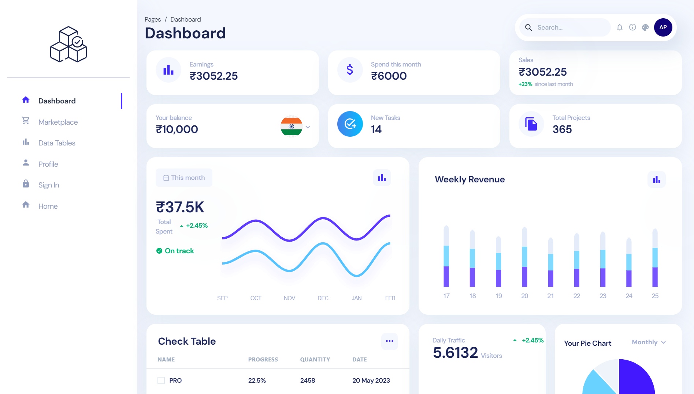

# Frontend Sample - UI Design



A simple frontend UI sample built with React, showcasing modern design practices. This project demonstrates clean and responsive design techniques suitable for various web applications.

## Live Demo

Check out the live version here: [Frontend Sample](https://frontend-sample-5fzu.onrender.com/)

## Features

- **Responsive Design**: Adapts to various screen sizes, ensuring a consistent experience across devices.
- **Modern UI/UX**: Incorporates current design trends, including smooth animations, intuitive navigation, and clean layouts.
- **Component-Based Architecture**: Organized code structure with reusable React components.
- **Customizable**: Easy to modify and extend for different projects.
- **Cross-Browser Compatibility**: Works seamlessly on all major browsers.

## Technologies Used

- **React**: For building the user interface.
- **HTML5**: For the structure of the web pages.
- **CSS3**: For styling and layout.
- **JavaScript (ES6+)**: For component logic and interactive features.

## Getting Started

### Prerequisites

Make sure you have the following installed:

- Node.js and npm (or yarn)
- A modern web browser (e.g., Chrome, Firefox, Edge)
- [Git](https://git-scm.com/)
- A code editor like [VS Code](https://code.visualstudio.com/)

### Installation

1. Clone the repository:

    ```bash
    git clone https://github.com/Tusharmohanpuria/Frontend_Sample.git
    ```

2. Navigate to the project directory:

    ```bash
    cd Frontend_Sample
    ```

3. Install the dependencies:

    ```bash
    npm install
    ```

4. Start the development server:

    ```bash
    npm start
    ```

5. Open `http://localhost:3000` in your browser to view the project locally.

### Customization

- **Styles**: Modify `src/styles.css` or the relevant component styles to change the look and feel of the UI.
- **Components**: Update or create new components in the `src/components` directory to add or modify functionality.
- **State Management**: Use React's built-in state or integrate a state management library if needed.

## Contributing

Contributions are welcome! Please follow these steps:

1. Fork the repository.
2. Create a new branch (`git checkout -b feature-branch`).
3. Make your changes.
4. Commit and push to your branch.
5. Create a pull request.
